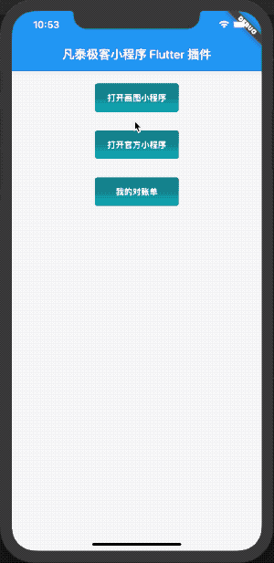

# 深入小程序系列之二、Flutter 和小程序混编

## 背景

本文我们将开一下脑洞，在 Flutter 工程基础上下集成及运行小程序方案。

先看一下效果如下:



## 新建 Flutter 样例工程

### Flutter 的安装

Flutter 的安装可参考[https://flutterchina.club/get-started/install/](https://flutterchina.club/get-started/install/)具体上主要执行以下三步即可。本文将使用 Flutter1.12.hotfix8 稳定版作为开发环境。

1. 下载 FlutterSDK
2. 配置 PATH 环境路径
3. flutter doctor 检查环境

### 新建 Flutter 工程

```bash

flutter create --template=app --org=com.finogeeks.flutter --project-name=mini_flutter -i objc -a java ./mini_flutter

```

执行以上命令后，正常将会提示以下信息

```bash
All done!
[✓] Flutter: is fully installed. (Channel stable, v1.12.13+hotfix.8, on Mac OS X 10.15.3 19D76, locale zh-Hans-CN)
[✓] Android toolchain - develop for Android devices: is fully installed. (Android SDK version 29.0.3)
[✓] Xcode - develop for iOS and macOS: is fully installed. (Xcode 11.3.1)
[✓] Android Studio: is fully installed. (version 3.6)
[!] IntelliJ IDEA Ultimate Edition: is partially installed; more components are available. (version 2019.3.3)
[✓] VS Code: is fully installed. (version 1.42.1)
[!] Proxy Configuration: is partially installed; more components are available.
[✓] Connected device: is fully installed. (1 available)

Run "flutter doctor" for information about installing additional components.

In order to run your application, type:

  $ cd mini_flutter
  $ flutter run

Your application code is in mini_flutter/lib/main.dart.
```

注意！flutter 需要依赖本地安装对应的 iOS,Android 开发工具，即需要安装 Xcode 和 AndroidStudio。具体安装使用方法这里不赘述。
这里我们用 VSCode+Xcode 作为开发组合环境，如果要正常调试需要确保以下三个检查项目是正常的。

1. [✓] Xcode - develop for iOS and macOS: is fully installed. (Xcode 11.3.1)
2. Flutter: is fully installed. (Channel stable, v1.12.13+hotfix.8, on Mac OS X 10.15.3 19D76, locale zh-Hans-CN)
3. VS Code: is fully installed. (version 1.42.1)
   [!] Proxy Configuration: is partially installed; more components are available.

### 集成小程序解析引擎

这里我们采用凡泰集成免费社区版的小程序解析引擎，只需要 10 行代码量不到即可完成小程序集成。

1. 引入小程序引擎插件。在 pubspec.yaml 文件中引入小程序 Flutter 插件

   ```yaml
   mop: ^0.2.0
   ```

2. 在 main.dart 文件中增加以下小程序引擎初始化方法。 **Mop.instance.initialize** 这里需要用到 sdkkey 和 secret。可以直接在[https://mp.finogeeks.com](https://mp.finogeeks.com)免费注册获取。注册使用方法可以参考[接入指引](https://mp.finogeeks.com/mop/document/introduce/access/mechanism.html)

   ```dart

     // Platform messages are asynchronous, so we initialize in an async method.
     Future<void> init() async {
       if (Platform.isIOS) {
         final res = await Mop.instance.initialize(
             '22LyZEib0gLTQdU3MUauAYEY1h9s9YXzmGuSgQrin7UA', '9e05fa0015d7dbfa',
             apiServer: 'https://mp.finogeeks.com', apiPrefix: '/api/v1/mop');
         print(res);
       } else if (Platform.isAndroid) {
         final res = await Mop.instance.initialize(
             '22LyZEib0gLTQdU3MUauAYEY1h9s9YXzmGuSgQrin7UA', '9e05fa0015d7dbfa',
             apiServer: 'https://mp.finogeeks.com', apiPrefix: '/api/v1/mop');
         print(res);
       }
       if (!mounted) return;
     }
   ```

3. 在主界面上增加三个按钮来打开小程序

```dart
  Center(
    child: Container(
      padding: EdgeInsets.only(
        top: 20,
      ),
      child: Column(
        children: <Widget>[
          Container(
            width: 140,
            decoration: BoxDecoration(
              borderRadius: BorderRadius.all(Radius.circular(5)),
              gradient: LinearGradient(
                colors: const [Color(0xFF12767e), Color(0xFF0dabb8)],
                stops: const [0.0, 1.0],
                begin: Alignment.topCenter,
                end: Alignment.bottomCenter,
              ),
            ),
            child: FlatButton(
              onPressed: () {
                Mop.instance.openApplet('5e3c147a188211000141e9b1',
                    path: 'pages/index/index', query: '');
              },
              child: Text(
                '打开画图小程序',
                style: TextStyle(color: Colors.white),
              ),
            ),
          ),
          SizedBox(height: 30),
          Container(
            width: 140,
            decoration: BoxDecoration(
              borderRadius: BorderRadius.all(Radius.circular(5)),
              gradient: LinearGradient(
                colors: const [Color(0xFF12767e), Color(0xFF0dabb8)],
                stops: const [0.0, 1.0],
                begin: Alignment.topCenter,
                end: Alignment.bottomCenter,
              ),
            ),
            child: FlatButton(
              onPressed: () {
                Mop.instance.openApplet('5e4d123647edd60001055df1');
              },
              child: Text(
                '打开官方小程序',
                style: TextStyle(color: Colors.white),
              ),
            ),
          ),
          SizedBox(height: 30),
          Container(
            width: 140,
            decoration: BoxDecoration(
              borderRadius: BorderRadius.all(Radius.circular(5)),
              gradient: LinearGradient(
                colors: const [Color(0xFF12767e), Color(0xFF0dabb8)],
                stops: const [0.0, 1.0],
                begin: Alignment.topCenter,
                end: Alignment.bottomCenter,
              ),
            ),
            child: FlatButton(
              onPressed: () {
                Mop.instance.openApplet('5e637a18cbfae4000170fa7a');
              },
              child: Text(
                '我的对账单',
                style: TextStyle(color: Colors.white),
              ),
            ),
          ),
        ],
      ),
    ),
  )
```

4.  运行 Flutter 程序

- 在代码根目录执行 flutter devices 查看本机安装的模拟器。
- 执行 flutter run --debug 运行示例，运行效果之如本文最前面所展示的图示。
